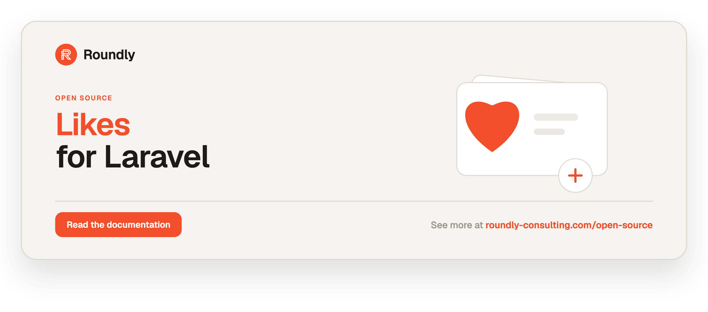

<!-- roundly-hero:start -->
<p align="center">
  <a href="https://roundly-consulting.com/open-source/docs/likes-for-laravel?utm_source=github&utm_medium=readme&utm_campaign=open-source&utm_content=likes-for-laravel">
    
  </a>
</p>
<!-- roundly-hero:end -->

<!-- roundly-badges:start -->
<p align="center">
  <a href="https://packagist.org/packages/roundly-consulting/likes-for-laravel"></a>
  <a href="https://github.com/roundly-consulting/likes-for-laravel/actions/workflows/run-tests.yml"></a>
  <a href="https://github.com/roundly-consulting/likes-for-laravel/actions/workflows/fix-php-code-style-issues.yml"></a>
  <a href="https://donate.stripe.com/dRmeVe8FX5PF1Qd9pXcEw00"></a>
  <a href="https://www.patreon.com/cw/roundly"></a>
  <a href="https://roundly-consulting.com/support-us?utm_source=github&utm_medium=readme&utm_campaign=open-source&utm_content=likes-for-laravel#crypto"></a>
</p>
<!-- roundly-badges:end -->

# Likes for Laravel

Lightweight Laravel package to handle likes and reactions on entities. Any Eloquent model
can give likes, any model can receive them, and a single polymorphic `likes` table records
who liked what — with optional typed reactions (love, wow, …), popularity and trending
scopes, single-query feed hydration, reaction breakdowns, a reverse "what X liked" relation,
a fluent facade, a testing toolkit, opt-in broadcasting, JSON resources, and events your
application can listen to.

## Requirements

- PHP `^8.4`
- Laravel `^12.0` or `^13.0`

### Integrates with

- [`package-toolkit-for-laravel`](https://github.com/roundly-consulting/package-toolkit-for-laravel) —
  the package is bootstrapped with the toolkit's `PackageServiceProvider`, so its config,
  publishable migration, facade alias and the `@liked` directive are wired through the shared
  builder, and `php artisan about` reports the configured reactions.

## Installation

Install the package via Composer:

```bash
composer require roundly-consulting/likes-for-laravel
```

Publish the migration into your application, then run it:

```bash
php artisan vendor:publish --tag="likes-migrations"
php artisan migrate
```

The migration is not loaded automatically — publishing it first keeps your schema in your own
`database/migrations`, where you can review or adjust it before it runs.

Optionally publish the config file:

```bash
php artisan vendor:publish --tag="likes-config"
```

## Configuration

The published config file (`config/likes.php`):

```php
<?php

declare(strict_types=1);

use RoundlyConsulting\Likes\Models\Like;

return [
    'model' => Like::class,
    'table' => env('LIKES_TABLE', 'likes'),
    'key_type' => env('LIKES_KEY_TYPE', 'bigint'),
    'reactions' => ['like'],
    'default_reaction' => env('LIKES_DEFAULT_REACTION', 'like'),
    'actor_resolver' => null,
    'facade_alias' => env('LIKES_FACADE_ALIAS', 'Likes'),

    'weights' => [
        // 'like' => 1,
        // 'love' => 4,
    ],
    'default_weight' => 1,

    'trending' => [
        'window' => '7 days',
        'recent_multiplier' => 3,
        'driver_expressions' => [
            // 'pgsql' => 'SUM(1 / POWER(EXTRACT(EPOCH FROM (NOW() - created_at)) / 3600 + 2, 1.8))',
        ],
    ],

    'broadcast' => [
        'enabled' => env('LIKES_BROADCAST', false),
        'channel_prefix' => 'likes',
        'channel_type' => 'private',
    ],
];
```

| Key                              | Type                            | Default          | Env                       | Purpose                                                                                       |
|----------------------------------|---------------------------------|------------------|---------------------------|-----------------------------------------------------------------------------------------------|
| `model`                          | `class-string`                  | `Like::class`    | —                         | Eloquent model used to persist each like. Swap in your own model (extending the package one).  |
| `table`                          | `string`                        | `likes`          | `LIKES_TABLE`             | Database table that stores likes. Read by both the migration and the model.                    |
| `key_type`                       | `string`                        | `bigint`         | `LIKES_KEY_TYPE`          | Key type of the polymorphic `actor_id` / `likeable_id` columns: `bigint`, `uuid` or `ulid`. Set it **before migrating** when your actors or likeables use UUID/ULID keys; any other value throws `InvalidConfigurationException`. |
| `reactions`                      | `list<string>`                  | `['like']`       | —                         | Allowlist of accepted reaction types. Any type outside the list is rejected.                   |
| `default_reaction`               | `string`                        | `like`           | `LIKES_DEFAULT_REACTION`  | Reaction used when none is given. Must be present in `reactions`.                              |
| `actor_resolver`                 | `callable\|class-string\|null`  | `null`           | —                         | How the facade resolves the actor when none is supplied. `null` uses `auth()->user()`; a value that does not resolve to a callable throws. |
| `facade_alias`                   | `string\|null`                  | `Likes`          | `LIKES_FACADE_ALIAS`      | Global class alias for the `Likes` facade. `null` or `false`/`0`/`off`/`no` (`LIKES_FACADE_ALIAS=false`) skip aliasing; a blank value is not set, so `Likes` is registered. |
| `weights`                        | `array<string, int\|float>`     | `[]`             | —                         | Per-reaction weights for `orderByLikeScore()`. Empty means the score equals the raw count.     |
| `default_weight`                 | `int\|float`                    | `1`              | —                         | Weight applied to any reaction not listed in `weights`.                                        |
| `trending.window`                | `string`                        | `7 days`         | —                         | `strtotime`-able recency window used by `orderByTrending()`.                                   |
| `trending.recent_multiplier`     | `int\|float`                    | `3`              | —                         | How much likes inside the window outweigh all-time activity.                                   |
| `trending.driver_expressions`    | `array<string, string>`         | `[]`             | —                         | Optional raw SQL aggregate per database driver (`sqlite`, `mysql`, `pgsql`, …) that replaces the trending score for queries on a connection of that driver. Every `?` is bound to the window cut-off. |
| `broadcast.enabled`              | `bool`                          | `false`          | `LIKES_BROADCAST`         | Opt-in broadcasting of `Liked`/`Unliked`/`ReactionChanged`. Off by default. Env strings such as `true`/`1`/`on` and `false`/`0`/`off` are understood; anything else throws `InvalidConfigurationException`. |
| `broadcast.channel_prefix`       | `string`                        | `likes`          | —                         | Channel name prefix, e.g. `likes.posts.42`.                                                    |
| `broadcast.channel_type`         | `string`                        | `private`        | —                         | Channel type: `private`, `public`, or `presence`; anything else throws.                       |

A key that is not set — absent, `null`, or blank like a host's `LIKES_TABLE=` — takes its
default (a blank driver expression: the portable score). A value that is set must fit:
a non-string `table`, `default_reaction`, `trending.window` or `broadcast.channel_prefix`,
a `reactions` list that is empty or holds a non-string, a non-numeric weight, multiplier or
default weight, a non-string driver expression, or a `broadcast.channel_type` typo (it no longer
reads as private) throws `InvalidConfigurationException` instead of falling back or being
dropped. `php artisan about` renders a broken reaction setting as `INVALID`.

## Usage

Add the `HasLikes` trait to models that can be liked, and the `GivesLikes` trait to models
that can give likes:

```php
use Illuminate\Database\Eloquent\Model;
use RoundlyConsulting\Likes\Traits\GivesLikes;
use RoundlyConsulting\Likes\Traits\HasLikes;

class Post extends Model
{
    use HasLikes;
}

class User extends Model
{
    use GivesLikes;
}
```

### The `Likes` facade

The facade resolves the actor from the authenticated user by default, so the common path is
one line. Override the actor or reaction type with the fluent builder, and read one likeable
with `Likes::for()`:

```php
use RoundlyConsulting\Likes\Facades\Likes;

Likes::like($post);                     // as the authenticated user
Likes::unlike($post);
Likes::toggle($post);
Likes::react($post);                    // one active reaction per actor + likeable
Likes::has($post);                      // bool
Likes::likeMany([$post, $comment]);
Likes::unlikeMany([$post, $comment]);

Likes::actor($user)->like($comment);    // as any actor
Likes::actor($team)->toggle($post);
Likes::as('love')->like($post);         // typed reaction
Likes::actor($user)->as('wow')->toggle($post);
Likes::actor($user)->as('love')->react($post);  // switch reaction in place
Likes::actor($user)->has($post);
Likes::actor($user)->likeMany([$post, $comment]);

Likes::for($post)->count();             // int — all reactions (uses an eager-loaded likes_count)
Likes::for($post)->count('love');       // int — one reaction type
Likes::for($post)->summary($viewer);    // ReactionSummary (viewer defaults to the resolved actor)
Likes::for($post)->likedBy($user);      // bool — default reaction type unless given
```

The model traits are sugar over the same manager: `$user->like($post)` is
`Likes::actor($user)->like($post)`, `$post->likesCount()` is `Likes::for($post)->count()`, and
`$post->reactionSummary()` is `Likes::for($post)->summary()`.

If no actor is supplied and none can be resolved, a
`RoundlyConsulting\Likes\Exceptions\NoAuthenticatedActorException` is thrown. Configure a
custom resolver (for non-`web` guards or non-user actors) via `actor_resolver`:

```php
'actor_resolver' => fn () => auth('api')->user(),
// or an invokable class-string:
'actor_resolver' => \App\Likes\CurrentActorResolver::class,
```

#### Without the facade

Inject the manager — the same API — or call an action directly:

```php
use RoundlyConsulting\Likes\Actions\LikeAction;
use RoundlyConsulting\Likes\DataTransferObjects\LikeData;
use RoundlyConsulting\Likes\LikeManager;

final class LikePost
{
    public function __construct(private LikeManager $likes) {}

    public function __invoke(User $user, Post $post): bool
    {
        return $this->likes->actor($user)->as('love')->like($post);
    }
}

app(LikeAction::class)->execute(new LikeData($user, $post, 'love'));
```

| Facade / builder method | Action |
|---|---|
| `like()` | `LikeAction` |
| `unlike()` | `UnlikeAction` |
| `toggle()` | `ToggleLikeAction` |
| `react()` | `SwitchReactionAction` |
| `likeMany()` | `LikeManyAction` |
| `unlikeMany()` | `UnlikeManyAction` |

#### Faking in your tests

`Likes::fake()` swaps the manager — for the facade **and** for injected `LikeManager`s — with a
recording fake that **still performs** the operations, so `has()`, `for()` and your own
queries see real rows. Every completed write is recorded, whichever way it was made: the
facade, the `actor()`/`as()` builder, bulk calls (one entry per model), the `GivesLikes` trait
and the `InteractsWithLikes` helpers. A write the package refuses (an unknown reaction type,
no resolvable actor) throws and is **not** recorded, so an assertion never passes over a write
that did not happen.

```php
use RoundlyConsulting\Likes\Facades\Likes;

$fake = Likes::fake();

$user->like($post);
Likes::actor($user)->unlike($comment);
Likes::actor($user)->as('love')->react($photo);

$fake->assertLiked($post);                    // optionally a type: an untyped like matches the default type
$fake->assertLikedBy($user, $post);
$fake->assertNotLiked($other);
$fake->assertLikedCount(1);
$fake->assertLikedTimes($post, 1);
$fake->assertUnliked($comment, by: $user);
$fake->assertReacted($photo, 'love');
```

To assert that code performed no write of a kind, use `assertNothingLiked()`,
`assertNothingUnliked()` or `assertNothingReacted()`:

```php
$fake = Likes::fake();

$user->toggleLike($post);  // likes it
$user->toggleLike($post);  // unlikes it again

$fake->assertLikedCount(1);
$fake->assertUnliked($post);
$fake->assertNothingReacted();
```

A toggle is recorded as the like or unlike it performed; `react()` is recorded as a reaction
(assert it with `assertReacted()`, not `assertLiked()`).

The `InteractsWithLikes` trait adds acting-actor helpers:

```php
uses(RoundlyConsulting\Likes\Testing\InteractsWithLikes::class);

$this->actingAsLiker($user);
$this->likeAs($post, 'love');
$this->unlikeAs($post);
$this->toggleAs($post);
```

Register the Pest matchers once in your `tests/Pest.php`:

```php
RoundlyConsulting\Likes\Testing\LikeExpectations::register();

expect($post)->toBeLikedBy($user);
expect($post)->toBeLikedBy($user, 'love');
expect($post)->toHaveReaction('love');
```

The matchers are guarded by `function_exists('expect')`, so Pest is never pulled into your
runtime.

### Liking, unliking, toggling

All three verbs are idempotent and return a boolean meaning **"is-liked-now"** — so `like()`
returns `true`, `unlike()` returns `false`, and `toggleLike()` returns the resulting state:

```php
$post = Post::find(1);
$user = auth()->user();

$user->like($post);        // true  — ensure liked (no-op if already liked)
$user->unlike($post);      // false — ensure not liked (no-op if not liked)
$user->toggleLike($post);  // true on like, false on unlike
```

Re-liking restores a previously removed like rather than creating a duplicate row, so each
actor keeps a single record per likeable and reaction type. A unique index on the table
enforces it, so this also holds under concurrency: a double-click, a second tab or a retried
request can never create a second row, and only the request that actually changed something
fires `Liked` / `Unliked`.

### Checking state and counting

```php
$post->hasBeenLikedBy($user);  // bool
$post->isLikedBy($user);       // bool — readable alias of hasBeenLikedBy()
$user->hasLiked($post);        // bool

$post->likesCount();           // int — all reactions; uses an eager-loaded likes_count when present
$post->likesCount('love');     // int — one type; uses an eager-loaded likes_love_count when present

Likes::for($post)->likedBy($user);  // the same reads through the facade
Likes::for($post)->count();
```

### Query scopes

```php
Post::orderByLikesDesc()->limit(10)->get();  // most-liked first (no N+1)
Post::orderByLikes()->get();                 // least-liked first
Post::whereLikedBy($user)->get();            // posts the user liked
Post::whereNotLikedBy($user)->get();         // posts the user has not liked
Post::withLikesCount()->get();               // hydrate a `likes_count` attribute
```

Every scope takes an optional reaction type. A typed count lands in its own attribute, so it
is never mistaken for the all-reactions total:

```php
Post::withLikesCount('love')->get();         // hydrate `likes_love_count`
Post::orderByLikesDesc('love')->get();       // ordered by, and hydrating, `likes_love_count`
Post::withLikesCount()->withLikesCount('love')->get();  // both attributes on one row
```

### Feed hydration (no N+1)

Render per-row viewer state for an entire feed page in a **single query** instead of one
`exists()` per row. `withLikedState()` adds two attributes to each model:

```php
$posts = Post::query()
    ->withLikedState()      // adds is_liked + liked_reaction for the current viewer
    ->withLikesCount()      // composes — still one query
    ->latest()
    ->paginate();
```

```blade
@foreach ($posts as $post)
    {{ $post->is_liked ? '♥' : '♡' }} {{ $post->likes_count }}
@endforeach
```

- `is_liked` is a `0`/`1` flag; `liked_reaction` is the viewer's reaction type or `null`. When
  the viewer left several reactions, `liked_reaction` is the one listed first in
  `config('likes.reactions')`.
- The actor defaults to the resolved auth actor; pass one explicitly with
  `withLikedState($actor)` and narrow to a reaction with `withLikedState($actor, 'love')`.
- For guests (no resolvable actor) it renders `is_liked = 0` / `liked_reaction = null` without
  throwing, so guest feeds still work.

### Ranking: weighted score and trending

```php
Post::orderByLikeScore()->get();    // rank by a weighted sum of reactions (desc)
Post::orderByTrending()->get();     // rank by recency-weighted activity (desc)
```

`orderByLikeScore()` uses `config('likes.weights')`; with the default (all weights `1`) the
score equals the raw like count. Give some reactions more pull:

```php
'weights' => ['like' => 1, 'love' => 4],
```

`orderByTrending()` boosts likes inside `config('likes.trending.window')` by
`recent_multiplier` over all-time activity. Both scopes accept a direction and an optional
reaction type, compose with other scopes, and use portable SQL (SQLite/MySQL/Postgres).

Hosts that want an exact decay curve can replace the trending score per database driver with a
raw SQL aggregate over the likes rows. It is used verbatim for queries on a connection of that
driver (the portable hybrid is used for any other), and every `?` in it is bound to the window
cut-off (now minus `trending.window`):

```php
'trending' => [
    'window' => '7 days',
    'recent_multiplier' => 3,
    'driver_expressions' => [
        // Gravity: each like decays with its age in hours.
        'pgsql' => 'SUM(1 / POWER(EXTRACT(EPOCH FROM (NOW() - created_at)) / 3600 + 2, 1.8))',
        // Recent likes count 10x, bound to the window cut-off.
        'sqlite' => 'SUM(CASE WHEN created_at >= ? THEN 10 ELSE 1 END)',
    ],
],
```

The expression is host configuration, never user input — it is placed into the query as
written.

```php
Post::orderByLikeScore('asc')->get();
Post::orderByTrending('desc', 'love')->get();   // trending loves
```

### Reaction breakdown

One grouped query produces a `ReactionSummary` for reaction bars and counters:

```php
$summary = $post->reactionSummary();        // optionally pass a viewer; = Likes::for($post)->summary()
$summary->total;            // int — sum of all reactions
$summary->countFor('love'); // int
$summary->has('love');      // bool
$summary->top;              // ?string — most-used type (config order breaks ties), null if none
$summary->viewerReaction;   // ?string — the viewer's active reaction (the first configured one if several), null without one
$summary->toArray();        // ['total' => .., 'counts' => [...], 'top' => .., 'viewer' => ..]
```

### Switch a reaction in place

`react()` keeps **one active reaction per actor + likeable**: reacting with a new type switches
the existing reaction instead of adding a second one.

```php
$user->react($post, 'love');                  // trait
$user->switchReaction($post, 'wow');          // readable alias
Likes::actor($user)->as('love')->react($post); // facade
```

- No prior reaction → behaves like `like()` (fires `Liked`).
- Same type → no-op, returns `true`.
- Different type → switches the reaction and fires **only** `ReactionChanged(from, to)`
  (never `Liked`/`Unliked`), so analytics and notifications see a clean
  transition. The row is switched in place, or — when the actor used the new type before —
  that type's own removed row is restored and the old one removed.

Keep using `like('love')` + `like('wow')` when you want **multiple** simultaneous reactions
per actor; use `react()` for the common **single**-reaction case. Calling `react()` on an actor
that holds several reactions collapses them to one: the requested type stays (or the newest
reaction switches to it, firing `ReactionChanged`), and every other active reaction is removed,
firing `Unliked` for each.

### What an actor liked (reverse relation)

```php
$user->likedItems(Post::class)->get();              // posts the user actively likes
$user->likedItems(Post::class, 'love')->get();      // filtered by reaction
$user->likedItems(Post::class)->with('author')->paginate();  // real relation — eager-load & paginate
$user->likesOf(Post::class);                         // the underlying MorphToMany relation
```

Each item comes back **once**, however many reactions the actor left on it, and
`paginate()->total()` counts items, not reactions. The pivot's `type` is the actor's earliest
active reaction on the item (or the requested type when you filter by one). Soft-deleted
(unliked) items drop out automatically and reappear on a re-like.

### API surface

```php
use RoundlyConsulting\Likes\Http\Resources\LikeResource;

return LikeResource::make($post);          // resolves the viewer from the request user
// or build the array yourself:
$post->toLikeArray($request->user());
// => [
//   'count' => 12,
//   'viewer_state' => ['liked' => true, 'reaction' => 'love'],
//   'breakdown' => ['like' => 8, 'love' => 4],
// ]
```

### Typed reactions (opt-in)

By default a single implicit `like` reaction is configured, so behaviour is unchanged. Add
more to `config/likes.php` to enable typed reactions:

```php
'reactions' => ['like', 'love', 'wow', 'laugh'],
'default_reaction' => 'like',
```

Then pass a type to any verb, check, count, or scope:

```php
$user->like($post, 'love');
$post->isLikedBy($user, 'love');
$post->likesCount('love');
Post::orderByLikesDesc('love')->get();
```

An unconfigured type throws `RoundlyConsulting\Likes\Exceptions\InvalidReactionTypeException`.

### Bulk operations

```php
$user->likeMany([$post, $comment, $photo]);
$user->unlikeMany([$post, $comment]);

Likes::likeMany([$post, $comment]);     // as the resolved actor
```

### Blade directive

```blade
@liked($post)
    <x-icon name="heart-filled" />
@else
    <x-icon name="heart" />
@endliked
```

`@liked($model)` uses the authenticated actor; `@liked($model, $actor)` honours an explicit
actor; `@liked($model, $actor, 'love')` honours a reaction type.

### Events

Idempotent no-ops (liking what's already liked, unliking what isn't) dispatch **no** events.
On a real change the package fires exactly one event:

```php
use RoundlyConsulting\Likes\Events\Liked;
use RoundlyConsulting\Likes\Events\Unliked;

class NotifyAuthor
{
    public function handle(Liked $event): void
    {
        // $event->actor, $event->likeable, $event->type, $event->like
    }
}
```

| Event             | When                          | Properties                                       |
|-------------------|-------------------------------|--------------------------------------------------|
| `Liked`           | a like is created             | `actor`, `likeable`, `type`, `like`              |
| `Unliked`         | a like is removed             | `actor`, `likeable`, `type`, `like`              |
| `ReactionChanged` | a reaction is switched (`react()`) | `actor`, `likeable`, `from`, `to`, `like`   |

`react()` also fires `Unliked` for each extra reaction it removes when collapsing several into
one.

### Broadcasting (opt-in, default off)

`Liked`, `Unliked`, and `ReactionChanged` can broadcast over Laravel Echo. Broadcasting is
**off by default**. Enable it in `config/likes.php`:

```php
'broadcast' => [
    'enabled' => env('LIKES_BROADCAST', true),
    'channel_prefix' => 'likes',
    'channel_type' => 'private',   // private | public | presence
],
```

When enabled, each event broadcasts on `{channel_prefix}.{morph}.{id}` (e.g.
`likes.posts.42`) with stable names `like.created`, `like.removed`, and `reaction.changed`.
The payload carries ids and the reaction only — never the actor or likeable models, so no
attribute of your users ever reaches a channel subscriber:

```php
// like.created / like.removed
['like_id' => 7, 'actor_type' => 'App\Models\User', 'actor_id' => 1,
 'likeable_type' => 'App\Models\Post', 'likeable_id' => 42, 'type' => 'love']

// reaction.changed — `from` / `to` instead of `type`
[..., 'from' => 'like', 'to' => 'love']
```

Load anything else you need client-side by id. The events keep dispatching as plain events for
your listeners regardless of this setting.

#### Optional: a persisted counter column

This package does not add columns to your own tables. For O(1) counts you can use
`withLikesCount()` / `loadCount('likes')`, or maintain your own counter column with a small
listener — for example incrementing a `likes_count` column on the likeable:

```php
use RoundlyConsulting\Likes\Events\Liked;
use RoundlyConsulting\Likes\Events\Unliked;

class SyncLikesCounter
{
    public function increment(Liked $event): void
    {
        $event->likeable->increment('likes_count');
    }

    public function decrement(Unliked $event): void
    {
        $event->likeable->decrement('likes_count');
    }
}
```

Register it in your own `EventServiceProvider`; the package does not auto-register it.

## Testing

```bash
composer test
```

## Changelog

Please see [CHANGELOG](CHANGELOG.md) for more information on what has changed recently.

## Contributing

Please see [CONTRIBUTING](https://github.com/roundly-consulting/.github/blob/main/CONTRIBUTING.md) for details.

## Security Vulnerabilities

Please review [our security policy](../../security/policy) on how to report security
vulnerabilities.

## Credits

- [Andrej Mihaliak](https://github.com/mihaliak)
- [All Contributors](../../contributors)

<!-- roundly-support:start -->
## Support our work

This package is free and open source, built and maintained by
[Roundly Consulting](https://roundly-consulting.com/open-source?utm_source=github&utm_medium=readme&utm_campaign=open-source&utm_content=likes-for-laravel).
If it saves you time, please consider supporting our open-source work — a one-time donation, a
monthly pledge on Patreon or a crypto donation helps fund maintenance, new features and new
packages.

<a href="https://donate.stripe.com/dRmeVe8FX5PF1Qd9pXcEw00"></a>
<a href="https://www.patreon.com/cw/roundly"></a>
<a href="https://roundly-consulting.com/support-us?utm_source=github&utm_medium=readme&utm_campaign=open-source&utm_content=likes-for-laravel#crypto"></a>
<!-- roundly-support:end -->

## License

The MIT License (MIT). Please see [License File](LICENSE.md) for more information.
